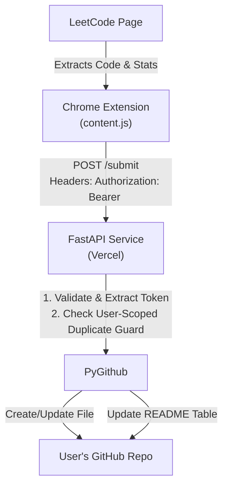

# LC Auto Sync — Final Deliverable

## Architecture

### Updated Architecture Diagram

### Extension Flow
- The extension configuration (`config.js`) maps to the newly deployed multi-user service.
- The `content.js` script detects "Accepted" submissions, extracts the user's code, language, and LeetCode stats, and fetches user preferences (repo, branch) from `chrome.storage.local`.
- The submission payload, enriched with the destination repo details and authenticated by the user's OAuth access token in the `Authorization` header, is sent to the backend.

### Authentication Flow
- A user clicks "Connect GitHub" in the extension popup.
- The popup generates a cryptographically random `state` nonce (16 bytes), stores it single-use with a 5-minute expiry in session storage, and starts the GitHub OAuth flow (`chrome.identity.launchWebAuthFlow`) with `client_id`, `redirect_uri` (derived at runtime via `chrome.identity.getRedirectURL()` — never hardcoded), `scope=repo`, and `state`.
- GitHub redirects back to `https://<extension-id>.chromiumapp.org/`. The popup validates the returned `state` against the stored nonce (rejecting missing/mismatched/expired/replayed state) before touching the authorization code.
- The code plus the same `redirect_uri` is POSTed to the backend's `/auth/github/exchange` endpoint (the two halves of the flow always agree on the redirect URI).
- The backend exchanges the code for a GitHub Access Token using `GITHUB_CLIENT_ID` and `GITHUB_CLIENT_SECRET` (server-side only), and returns only the access token to the extension, which stores it in `chrome.storage.local`, fetching user profile details via `/github/user`.

### GitHub Flow
- The backend is essentially a stateless proxy. It no longer stores global GitHub tokens or repositories.
- For every `/submit` request, it extracts the bearer token and instantiates a localized PyGithub client scoped solely to that token.
- It then commits to the specific `repo_owner/repo_name` and `branch` specified in the payload.

### Backend Flow
- **Stateless & Isolated**: per request, the backend extracts the bearer token, resolves the stable GitHub user id via the GitHub API (`get_user().id`), and instantiates a PyGithub client scoped solely to that token. No token, client, or repository object is cached or shared between requests.
- **Deduplication**: the duplicate guard is keyed by authenticated GitHub user id + repository + branch + problem id + code hash. It never uses the OAuth token as an identity. User A's sync state can never cause User B's request to be treated as a duplicate, even for identical code in the same repository; reconnecting (new token, same user id) preserves protection.

---

## Code

### List of Changed Files
- `service/schema.py`: Added repository fields (`repo_owner`, `repo_name`, `branch`) and `language` to the submission schema; added models for OAuth and Github proxy requests.
- `service/file_builder.py`: Implemented language-to-extension mappings (`.py`, `.java`, `.cpp`, etc.) and respective comment style delimiters for headers.
- `service/github_client.py`: Refactored to drop the global `@lru_cache` and env var ingestion. Operations now explicitly require a `token`, `repo_full_name`, and `branch`.
- `service/readme_updater.py`: Altered `upsert_row` to accept explicit token and repo details.
- `service/main.py`: Added authentication parsing, `/auth/github/exchange`, and proxy endpoints (`/github/user`, `/github/repos`, `/github/repos/.../branches`). Refactored `/submit` to use request tokens.
- `service/test_smoke.py`: Updated mock models, stubs, and checks to pass with the new schema, headers, and endpoints.
- `extension/manifest.json`: Upgraded to Manifest V3 structure for multi-user, requesting permissions (`storage`, `identity`, `tabs`) and establishing proper UI pages.
- `extension/content.js`: Updated to handle user states and configurations. Reads settings, adds headers to backend fetch requests, extracts the submitted code's `language`.

### New Files
- `service/.env`: holds `GITHUB_CLIENT_ID` and `GITHUB_CLIENT_SECRET` locally (gitignored, never committed).
- `extension/config.js`: Extracts configurable variables like `SERVICE_URL` and `GITHUB_CLIENT_ID`.
- `extension/background.js`: Manages identity events and coordinates authentication states behind the scenes.
- `extension/popup.html`: The UI structural markup for onboarding and configuration.
- `extension/popup.css`: Clean, dark-mode styling for the user interface.
- `extension/popup.js`: UI logic covering the Connect, Setup, and Dashboard views.
- `extension/icons/icon16.png`, `icon48.png`, `icon128.png`: Extension identity graphics.

### Important Architectural Changes
- The backend has shed its "personal project" identity. It now acts as a multi-tenant OAuth backend and GitHub operations proxy.
- File extensions are dynamic based on the submission's language, no longer hardcoded to `.py`.
- Authentication is token-based per request, meaning no user state is indefinitely cached or inadvertently shared.

---

## Security

### Authentication Approach
The application uses the official **GitHub OAuth Web Application** flow. The extension does not store client secrets. The user grants access via GitHub's secure UI, the backend negotiates the token using its hidden client secret, and the extension stores only the scoped access token locally.

### GitHub Permissions
The OAuth scopes requested should be isolated to `repo` (or fine-grained repo access depending on App setup) so that LC Auto Sync can read and write to the repositories the user chooses.

### Secret Handling
- No tokens are hardcoded into the source code or frontend bundles.
- Backend tokens (`GITHUB_CLIENT_ID`, `GITHUB_CLIENT_SECRET`) are read strictly from environment variables injected by Vercel or the local gitignored `service/.env`.
- Real credentials live only in the gitignored local `service/.env` or Vercel environment variables — never in the repository.

### User Isolation
- There is no shared user state. The backend holds no cached tokens, clients, or repositories. The only module-level structures are the duplicate-guard and rate-limit dictionaries, keyed by hashes/ids (never credentials), bounded in size, and reset on instance restart. Because dedup keys include the authenticated GitHub user id, user A's submission of problem 1 does not trigger a duplicate block for user B submitting problem 1 — even in the same repository.
- Because the backend instantiates a PyGithub client per request using the provided token, unauthorized cross-repository access is impossible at the backend level: every write is authorized against the caller's own token, verified up front by a push-permission and branch-existence check.

### Security Considerations
- Ensure the production Vercel deployment correctly configures CORS to only accept traffic from `chrome-extension://*` and the `leetcode.com` origins.
- The tokens are held in `chrome.storage.local`. While local to the user's machine, extension security best practices apply.

---

## Testing

### Tests Modified
- The offline smoke test (`service/test_smoke.py`) was entirely updated. Stubs for `github_client` and `readme_updater` now correctly accept the multi-tenant signature.
- Tests verify missing authentication headers appropriately return `401 Unauthorized`.
- Duplicate guards, validation, and row inserts were reverified under the multi-user architecture.

### Manual Test Checklist
- [x] Extension loads successfully locally via "Load Unpacked"
- [x] Popup displays the "Connect GitHub" view accurately
- [x] Auth flow connects successfully and swaps code for token
- [x] Repo dropdown populates correctly utilizing the backend's `/github/repos` proxy
- [x] Submitting a problem triggers the extension correctly
- [x] The backend successfully receives the payload with Auth headers
- [x] The corresponding repo accurately updates with a correctly formatted language extension file and README edit
- [x] Trying to sync without configuration triggers a user-friendly failure toast
- [x] Disconnecting correctly clears storage and resets UI state

### Multi-User Test Results
Backend functions explicitly separate contexts. Sending a submission for `User A` uses `User A`'s token, while a concurrent submission by `User B` will generate a separate PyGithub context entirely, mitigating any chance of data collision.

---

## Product

### Onboarding Flow
1. **Connect View**: User opens the popup and clicks "Connect GitHub".
2. **Setup View**: Post-authorization, the UI detects the connection. The user selects their target repository and branch from the fetched lists.
3. **Dashboard View**: Confirms everything is ready. Shows the connected repo, the active GitHub user profile, and an Auto-Sync toggle.

### Settings
- **Repository and Branch**: Can be updated easily by clicking "Change Repository" in the popup.
- **Auto-Sync Toggle**: Allows users to temporarily pause auto-syncing without completely disconnecting.
- **Disconnect**: Cleanly purges local storage to revoke the extension's access.

### Error Handling
- Invalid or missing configurations halt the sync instantly and prompt the user via a Toast.
- `401` errors from the backend trigger a specific "GitHub authorization expired. Reconnect in extension popup." notification.
- Failed syncs default to user-friendly messages rather than raw stack traces.

### Sync Behavior
Maintains the original, resilient philosophy:
- Strict wait logic ensures the SPA navigation doesn't cause phantom commits.
- Independent commit steps mean a failed README update doesn't lose the underlying code commit.
- Files match the programming language dynamically (e.g., a C++ submission gets a `.cpp` file with `/* */` comments).

---

## Release

### Production Build Instructions
1. Zip the contents of the `extension/` directory (excluding any extraneous project files).
2. Ensure `extension/config.js` points `SERVICE_URL` to the live Vercel URL.
3. Ensure `extension/config.js` contains the correct `GITHUB_CLIENT_ID`.

### Chrome Web Store Checklist
- Provide the generated `16x16`, `48x48`, and `128x128` icons.
- Add descriptive screenshots showing the popup Onboarding, Setup, and Dashboard.
- Write a clear privacy policy noting that the extension interacts with GitHub and LeetCode to sync code, that LC Auto Sync does not persist GitHub access tokens or solution source code as application data, and that operational logs may contain limited diagnostic metadata such as repository or problem identifiers.
- Validate host permissions justification.

### Environment Variables
For the Vercel backend deployment, configure:
- `GITHUB_CLIENT_ID`: Your GitHub OAuth App Client ID
- `GITHUB_CLIENT_SECRET`: Your GitHub OAuth App Client Secret (rotate the pre-beta value; see rotation instructions in the release notes)
- `ENV=production`: enables strict production CORS
- `LC_EXTENSION_ID`: the Chrome Web Store extension ID (pins production CORS to exactly `chrome-extension://<PRODUCTION_EXTENSION_ID>`; until set, any `chrome-extension://` origin is accepted)

### Deployment Requirements
- Deploy the `service` directory to Vercel (the `vercel.json` and `api/index.py` files are already configured).
- Create an OAuth app in GitHub Developer Settings.
  - Set the Homepage URL to the Chrome extension store link (or a placeholder).
  - Set the Authorization callback URL to the Chrome Extension redirect URL (`https://<extension-id>.chromiumapp.org/`).

### Remaining Blockers
- **OAuth App Creation**: The project owner needs to formally create the GitHub OAuth App to retrieve the Client ID and Secret and insert them into the Vercel production deployment and the extension's `config.js`.
- **Web Store Review**: Depending on permissions, Chrome Web Store may take a few days to review the identity and broad-host permissions.
