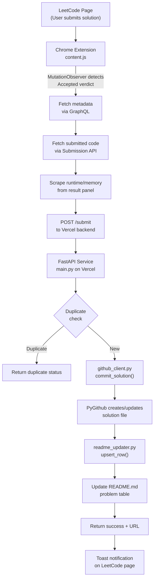

# LC AutoSync — Phase 0 Codebase Audit

> **Historical snapshot — superseded.** This document audited the original
> single-user implementation (`GITHUB_TOKEN`/`GITHUB_REPO` in `.env`, `.py`-only
> output, global per-`problem_id` duplicate guard). Those findings were
> addressed during multi-user hardening: per-user GitHub OAuth, per-request
> token-scoped clients, user-id-scoped dedup (user id + repo + branch + problem
> + code hash), per-language file extensions, and bounded input validation.
> For the implementation that actually ships, see `README.md`.
> The checklist below is preserved as-is for traceability.

## Current Architecture



### Components

| Component | Files | Purpose |
|---|---|---|
| **Chrome Extension** | `extension/manifest.json`, `extension/content.js`, `extension/toast.css` | Detects accepted submissions, extracts code+metadata, POSTs to backend |
| **FastAPI Backend** | `service/main.py`, `service/schema.py` | Receives submissions, validates, deduplicates, orchestrates GitHub operations |
| **GitHub Client** | `service/github_client.py` | Wraps PyGithub to create/update files in a single hardcoded repo |
| **File Builder** | `service/file_builder.py` | Generates file paths, content, and commit messages (pure functions) |
| **README Updater** | `service/readme_updater.py` | Maintains a markdown problem table in the repo's README.md |
| **Vercel Entry** | `api/index.py`, `vercel.json` | Serverless deployment bridge |
| **Tests** | `service/test_smoke.py` | Offline smoke test with GitHub stubbed |

---

## Current User Flow

```text
1. User solves a problem on leetcode.com
2. User clicks Submit
3. LeetCode shows "Accepted"
4. content.js MutationObserver fires on [data-e2e-locator="submission-result"]
5. 2-second delay for LeetCode to index the submission
6. GraphQL: fetch question metadata (id, title, slug, difficulty, tags)
7. GraphQL: fetch latest accepted submission code via submissionDetails
8. Scrape runtime/memory stats from the result panel DOM
9. POST JSON payload to https://lc-auto-sync.vercel.app/submit
10. Backend validates with Pydantic
11. Backend checks in-memory duplicate guard (10s window per problem_id)
12. github_client.commit_solution() creates/updates the .py file in the repo
13. readme_updater.upsert_row() updates the README problem table
14. Backend returns {status: "ok", url: "..."}
15. content.js shows a toast: "Committed <title> to GitHub"
16. Observer re-arms after the verdict clears for resubmits
```

---

## Hardcoded Personal Assumptions

> [!CAUTION]
> These are the items that MUST be changed to make the project multi-user.

### 1. GitHub Token & Repository (Single-User Backend)

| File | Line | Hardcoded Value | Problem |
|---|---|---|---|
| [`service/.env`](file:///c:/Projects/lc-autosync/service/.env#L1-L2) | 1–2 | `GITHUB_TOKEN=[REDACTED]` | Creator's personal access token |
| [`service/.env`](file:///c:/Projects/lc-autosync/service/.env#L2) | 2 | `GITHUB_REPO=devvrat015/leetcode-solutions` | Creator's personal repository |
| [`service/github_client.py`](file:///c:/Projects/lc-autosync/service/github_client.py#L21-L27) | 21–27 | `get_repo()` with `@lru_cache(maxsize=1)` | Caches a **single** repo object globally — all requests use the same token/repo |
| [`service/readme_updater.py`](file:///c:/Projects/lc-autosync/service/readme_updater.py#L78) | 78 | `get_repo()` call | Uses the same globally cached repo |

### 2. Service URL (Hardcoded in Extension)

| File | Line | Hardcoded Value | Problem |
|---|---|---|---|
| [`extension/content.js`](file:///c:/Projects/lc-autosync/extension/content.js#L7) | 7 | `const SERVICE_URL = "https://lc-auto-sync.vercel.app/submit"` | Hardcoded production URL — no dev/staging toggle |

### 3. Creator's Repo in Docs

| File | Line | Reference |
|---|---|---|
| [`PROJECT_OVERVIEW.md`](file:///c:/Projects/lc-autosync/PROJECT_OVERVIEW.md#L33) | 33 | `github.com/devvrat015/leetcode-solutions` |

### 4. File Extension Hardcoded to `.py`

| File | Line | Problem |
|---|---|---|
| [`service/file_builder.py`](file:///c:/Projects/lc-autosync/service/file_builder.py#L29) | 29 | Path always ends in `.py` regardless of actual submission language |
| [`service/file_builder.py`](file:///c:/Projects/lc-autosync/service/file_builder.py#L36) | 36 | Python docstring header `"""` for all files |

### 5. No User Identity

The entire backend has **zero concept of "which user is making this request"**:
- No authentication on `/submit`
- No user ID in the Submission schema
- No per-user GitHub credentials
- The duplicate guard is by `problem_id` globally, not per-user

### 6. localhost in Manifest

| File | Line | Problem |
|---|---|---|
| [`extension/manifest.json`](file:///c:/Projects/lc-autosync/extension/manifest.json#L10-L11) | 10–11 | `host_permissions` include `http://localhost:7337/*` and `http://127.0.0.1:7337/*` — development URLs in production manifest |

---

## Security Risks

> [!WARNING]

### Critical

1. **GitHub PAT in `.env` on disk** — The file `service/.env` contains a live GitHub personal access token. While `.gitignore` excludes `.env`, the file exists locally and is deployed via Vercel env vars.

2. **No authentication on `/submit`** — Anyone can POST to `https://lc-auto-sync.vercel.app/submit` and commit arbitrary content to the creator's GitHub repository. There is no API key, no token, no auth header, no rate limiting.

3. **Single-user token cached globally** — `@lru_cache(maxsize=1)` on `get_repo()` means if multi-user were naively attempted, all users would share the first user's credentials.

### Moderate

4. **CORS allows LeetCode origins only** — This is reasonable but also allows `https://lc-auto-sync.vercel.app` itself, which could be exploited.

5. **No input sanitization for file paths** — `resolve_path()` slugifies the tag and slug, but doesn't explicitly prevent path traversal (though the regex-based slugification makes it unlikely).

6. **Error log may contain sensitive data** — `log_error()` writes full tracebacks which could contain token fragments.

7. **localhost host_permissions in manifest** — Reveals the development architecture to anyone inspecting the extension.

### Low

8. **In-memory duplicate guard resets on cold start** — On Vercel serverless, each new instance starts with an empty `_recent` dict, so rapid resubmissions after a cold start may produce duplicate commits.

---

## Multi-User Problems

| Problem | Current State | Required Change |
|---|---|---|
| **User identity** | None — single user assumed | Each user needs their own GitHub OAuth connection |
| **GitHub credentials** | Single PAT in env vars | Per-user token storage |
| **Repository selection** | Single repo in env vars | Per-user repo/branch configuration |
| **Duplicate guard** | Global `problem_id` window | Per-user duplicate tracking |
| **File extension** | Always `.py` | Detect language from submission |
| **API authentication** | None | Extension must identify itself per-user |
| **Data isolation** | N/A (single user) | User A cannot access User B's config/data |

---

## Required Changes

### Phase 1 — Configuration Abstraction
- [ ] Remove hardcoded `.env` values; create `.env.example`
- [ ] Make file extension dynamic (detect language from submission)
- [ ] Add `language` field to Submission schema
- [ ] Map languages to file extensions
- [ ] Remove localhost from production manifest host_permissions
- [ ] Make SERVICE_URL environment-aware

### Phase 2 — GitHub Authentication (OAuth)
- [ ] Create a GitHub OAuth App (or GitHub App)
- [ ] Add OAuth flow endpoints: `/auth/github/start`, `/auth/github/callback`
- [ ] Store per-user GitHub tokens securely (encrypted in DB or secure session)
- [ ] Add user identification to all API requests
- [ ] Extension popup for "Connect GitHub" flow

### Phase 3 — Repository Selection
- [ ] API endpoint to list user's GitHub repositories
- [ ] API endpoint to list branches
- [ ] Store per-user repo/branch configuration
- [ ] Extension UI for repository selection

### Phase 4 — Multi-User Backend
- [ ] Add a database (SQLite or PostgreSQL)
- [ ] User model with GitHub identity
- [ ] Per-user settings model
- [ ] Per-user sync records
- [ ] Scope all GitHub operations to the authenticated user
- [ ] Remove `@lru_cache` on `get_repo()`
- [ ] Per-user duplicate guard

### Phase 5 — Extension UX
- [ ] Add popup.html with onboarding flow
- [ ] Settings page
- [ ] Connection status display
- [ ] Retry mechanism for failed syncs

---

## Optional Improvements

- [ ] Background service worker for better lifecycle management
- [ ] Offline queue for submissions when backend is unreachable
- [ ] Configurable folder organization
- [ ] Configurable commit message format
- [ ] Support for multiple languages per solution
- [ ] Sync history view
- [ ] Chrome Web Store listing assets (icons, screenshots)

---

## Potential Breaking Changes

| Change | Risk | Mitigation |
|---|---|---|
| Adding `language` field to Submission schema | Extension must send it; old backend would reject | Deploy backend first, then extension |
| OAuth replacing PAT | Creator's workflow changes | Ensure creator can OAuth with same account |
| Database addition | Deployment complexity increases | Use SQLite for simplicity |
| Per-user repo config | Backend no longer reads from env | Migration path for existing config |
| Dynamic file extensions | Existing `.py` files won't be renamed | Accept coexistence |

---

## What Must NOT Change

- ✅ MutationObserver-based detection logic (works well)
- ✅ GraphQL-based code retrieval (reliable)
- ✅ Scroll-stitch fallback (good safety net)
- ✅ Toast notification system (clean UX)
- ✅ SPA navigation handling (correctly handles LeetCode routing)
- ✅ README table management (surgical, well-designed)
- ✅ Partial-failure tolerance (solution commit independent of README)
- ✅ File organization structure (topics/tag/NNNN_slug.ext)
- ✅ Pydantic validation (solid boundary)
- ✅ Smoke test structure (good regression baseline)
